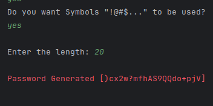

# PasswordGenerator 🔑

- This open source repository contains a Java Console Application to generate Random passwords and performing a Strength check.
- Make sure to ⭐️ the repository to stay tuned! 

## Showcase 🔭


|                                         |                                            |
|               :---:                     |                 :---:                      |
|             |           |
|          |       |


## Why to Open Source 🌐

1. **Community Collaboration**: Open sourcing your project invites a global community of developers to contribute, share ideas, and enhance its capabilities.

2. **Accelerated Development**: With a collective effort, open source projects progress faster, benefiting from diverse skill sets and constant feedback.

3. **Transparency and Trust**: Open source builds trust by allowing users to inspect code, ensuring security and transparency in software.

4. **Cost Efficiency**: It reduces development costs as contributors volunteer their time and resources, making it an economical choice.

5. **Longevity**: Open source projects tend to have longer lifespans, as they are not reliant on a single entity, ensuring sustainability.

## Tech Stack ⚡


## Installation 📥

> Install PasswordGenerator Repository with npm
>
> *(This will install all files, including all files and this README.md)*
>
> ```bash
>  npm install https://github.com/MiguelRolo/PasswordGenerator.git
>  cd GamesJs
> ```

## License 🪪

> (Apache License, Version 2.0) You're free to use this games and codes in any project, personal or commercial. 
>
> There's no need to ask permission before using theses. Giving attribution is not required, but appreciated.

